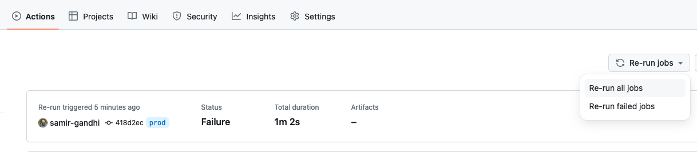
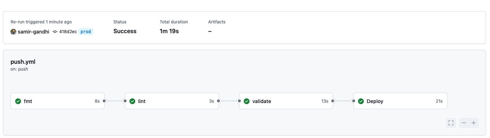
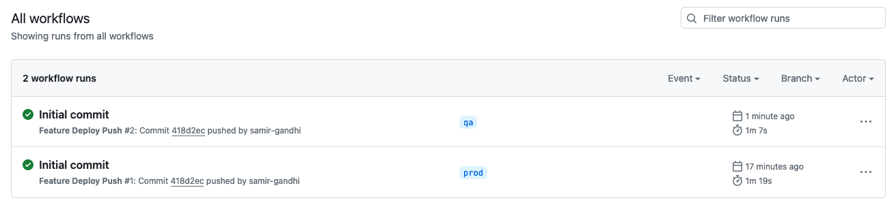
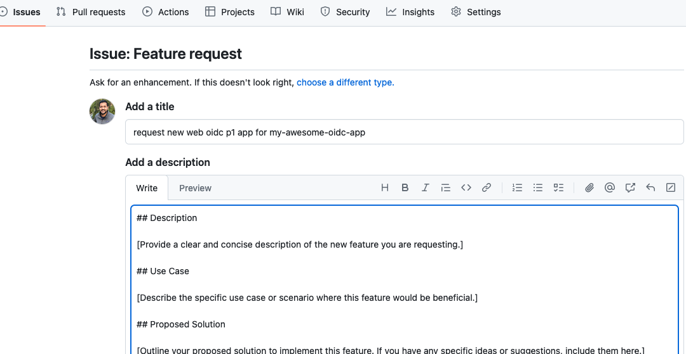
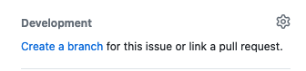
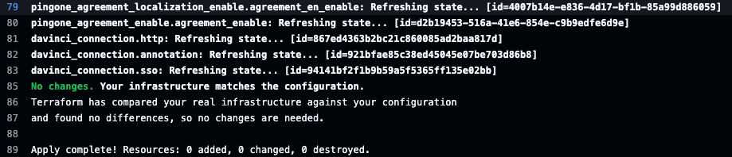
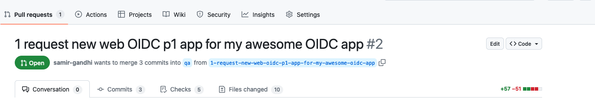

# Ping Platform Example Pipeline

The intention of this repository is to present a simplified reference demonstrating how a CICD pipeline might work for Ping Identity solutions. The configuration managed in this repository covers "platform" components that are complementary to the [infrastructure](https://github.com/pingidentity/pipeline-example-infrastructure) and [application](https://github.com/pingidentity/pipeline-example-application) example pipeline repositories.

**Infrastructure** - Components dealing with deploying software onto self-managed Kubernetes infrastructure and any configuration that must be delivered directly via the filesystem.

**Platform** - Components dealing with deploying configuration to self-managed or hosted services that will be shared and leveraged by upstream applications.

**Application** - Delivery and configuration of a client application that relies on core services from Platform and Infrastructure.

The use cases and features shown in this repository are an implementation of the guidance provided from Ping Identity's [Terraform Best Practices](https://terraform.pingidentity.com/best-practices/) and [Getting Started with Configuration Promotion at Ping](https://terraform.pingidentity.com/getting-started/configuration-promotion/) documents.

In this repository, the processes and features shown in a GitOps process of developing and delivering a new feature include:

- Feature Request Template
- On-demand development environment deployment
- Building a feature in development environment (PingOne UI)
- Extracting feature configuration to be stored as code
- Validating the extracted configuration from the developer perspective
- Validating that the suggested configuration adheres to contribution guidelines
- Review process of suggested change
- Approval of change and automatic deployment into higher environments

## Final Component Configuration before initial Deployment

After completing the next few sections, you will have the following items configured *before* you deploy the **prod** environment into your PingOne account for the first time:

### Worker Application

A worker application in the "Administrators" environment of PingOne (you can use another environment if you choose).  This worker application will have the following roles:

- `Environment Admin` for your organization
- `Organization Admin` for your organization
- `Identity Data Admin` for the environments necessary, which are the environment in which the application is located (*Administrators* in this example), and the Davinci Administrator environment where the Davinci Admin User is located.  As new environments are created by the pipeline, this application will be granted this role in those environments as well.

Information needed from this application (Applications > Applications > <application_name> > Overview):

- `Client ID` - This value will be assigned to **TF_VAR_pingone_client_id** in the localsecrets file
- `Client Secret` - This value will be assigned to **TF_VAR_pingone_client_secret** in the localsecrets file
- `Environment ID` - This value will be assigned to **TF_VAR_pingone_client_environment_id** in the localsecrets file

Information needed from the environment in which the application resides (Environment > Settings > Environment Properties):

- `Region` - This value will be assigned to **TF_VAR_pingone_client_region_code** in the localsecrets file
- `License ID` - This value will be assigned to **TF_VAR_pingone_license_id** in the localsecrets file
- `Environment Type` - This value will be assigned to **TF_VAR_pingone_environment_type** in the localsecrets file

### Davinci Administrator Environment, User and Group

An environment with the following characteristics:

- **PingOne SSO** and **PingOne DaVinci** services enabled
- A group for Davinci Administrators with the 'DaVinci Admin' role for the DaVinci Administrator environment
- A user in the Davinci Administrator environment that is a member of the Davinci Administrators group

Information needed from the user in the Davinci Administrator environment (Directory > Users > <user_name>):

- `Username` - This value will be assigned to **TF_VAR_pingone_davinci_admin_username** in the localsecrets file
- `Password` - This value will be assigned to **TF_VAR_pingone_davinci_admin_password** in the localsecrets file.  This password is created when you create and confirm the user.

Information needed from the environment in which the application resides (Environment > Settings > Environment Properties):

- `Environment ID` - This value will be assigned to **TF_VAR_pingone_davinci_admin_environment_id** in the localsecrets file

- `Region` - This value will be assigned to **TF_VAR_pingone_davinci_admin_region** in the localsecrets file

Information needed from the group in the Davinci Administrator environment (Directory > Groups > <group_name>):

- `Group ID` - This value will be assigned to **TF_VAR_pingone_davinci_terraform_group_id** in the localsecrets file

### AWS S3 Bucket

An AWS S3 bucket for storing Terraform state, and a user with permissions as specified in the Terraform documentation for an S3 backend.
> Note - The bucket should have folders for **prod**, **qa** and **dev** before your first pipeline attempt.  These directories should be nested under a folder named **platform-state** to align with the localsecrets settings for the bucket. The use of the parent folder allows the same bucket to be used for storing state for other efforts, such as an application pipeline.

Information needed from the AWS S3 bucket and user:

- `AWS Access Key ID` - This value for the user will be assigned to **AWS_ACCESS_KEY_ID** in the localsecrets file
- `AWS Secret Access Key` - This value for the user will be assigned to **AWS_SECRET_ACCESS_KEY** in the localsecrets file
- `Bucket Name` - This value will be assigned to **TF_VAR_tf_state_bucket** in the localsecrets file
- `Bucket region` - This value will be assigned to **TF_VAR_tf_state_region** in the localsecrets file

## Prerequisites

To be successful in recreating the use cases supported by this pipeline, there are initial steps that should be completed prior to configuring this repository:

- A [PingOne trial](https://docs.pingidentity.com/r/en-us/pingone/p1_start_a_pingone_trial) or paid account configured according to the [PingOne Terraform access](https://terraform.pingidentity.com/getting-started/pingone/) and [DaVinci Terraform](https://terraform.pingidentity.com/getting-started/davinci/) access guidelines.

> Note - For PingOne, meeting these requirements means you should have credentials for a worker app residing in the "Administrators" environment that has organization-level scoped roles. For DaVinci, you should have credentials for a user in a non-"Administrators" environment that is part of a group specifically intended to be used by command-line tools or APIs with environment-level scoped roles. This demonstration will add roles to the DaVinci command-line group and will fail if roles are not scoped properly.

- An [AWS trial](https://aws.amazon.com/free/?all-free-tier.sort-by=item.additionalFields.SortRank&all-free-tier.sort-order=asc&awsf.Free%20Tier%20Types=*all&awsf.Free%20Tier%20Categories=*all) or paid account
- Terraform CLI v1.6+
- [git](https://git-scm.com/book/en/v2/Getting-Started-Installing-Git)
- [gh](https://cli.github.com/) the Github CLI utility
- Additionally a few command-line tools are recommended for local development code review:
  - [tflint](https://github.com/terraform-linters/tflint)
  - [dvlint](https://github.com/pingidentity/dvlint)

### Repository Setup

Click the **Use this template** button at the top right of this page to create your own repository.  After the repository is created, clone it to your local machine to continue.  The rest of this guide will assume you are working from the root of the cloned repository.

> Note - A pipeline will run and fail when the repository is created. This result is expected as the pipeline is attempting to deploy and the necessary configuration has not been performed.

## Development Lifecycle Diagram

The use cases in this repository follow the flow in this diagram:


## Before You Start

There are a few items to configure before you can use this repository effectively.

### AWS S3 Bucket for Terraform State Storage

In order to avoid committing private information stored in terraform state to a code repository such as Github, and to have an efficient developer experience, it is a best practice to use a [remote backend for Terraform state](https://developer.hashicorp.com/terraform/language/settings/backends/remote). As such, this example uses AWS S3 for remote state management.

To avoid potential conflicts, there is no default information provided in this repository for the S3 bucket. The bucket name and region must be configured in the following files:

- Your *localsecrets* file (see the **Github Actions Secrets** section below)
- scripts/local_feature_deploy.sh

Details on appropriate permissions for the S3 bucket and corresponding AWS IAM user can be found on [Hashicorp's S3 Backend documentation](https://developer.hashicorp.com/terraform/language/settings/backends/s3)

### Github CLI and Github Actions Secrets

#### Github CLI

The Github cli: `gh` will need to be configured for your repository. Run the command **gh auth login** and follow the prompts.  You will need an access token for your Github account as instructed:

```bash
gh auth login

? What account do you want to log into? GitHub.com
? You're already logged into github.com. Do you want to re-authenticate? Yes
? What is your preferred protocol for Git operations? HTTPS
? Authenticate Git with your GitHub credentials? Yes
? How would you like to authenticate GitHub CLI? Paste an authentication token
Tip: you can generate a Personal Access Token here https://github.com/settings/tokens
The minimum required scopes are 'repo', 'read:org', 'workflow'.
? Paste your authentication token: ****************************************
- gh config set -h github.com git_protocol https
✓ Configured git protocol
✓ Logged in as <User>
```

#### Github Actions Secrets

The Github pipeline actions depend on sourcing some secrets as ephemeral environment variables. To prepare the secrets in the repository:

```bash
cp secretstemplate localsecrets
```

Fill in `localsecrets` accordingly.

> Note, `secretstemplate` is intended to be a template file, `localsecrets` is a file that contains credentials but is part of .gitignore and should never be committed into the repository.

Run the following to upload localsecrets to Github:

```bash
_secrets="$(base64 -i localsecrets)"
gh secret set --app actions TERRAFORM_ENV_BASE64 --body $_secrets
unset _secrets
```

> Note - On a Mac, if you have installed the **base64** application using brew, there will be a file content failure in the pipeline stemming from the first command shown above.  Use the default version of base64 by specifying the path explicitly: `_secrets="$(/usr/bin/base64 -i localsecrets)"`

### Deploy Prod and QA

The final step before creating new features is to deploy the static environments `prod` and `qa`.

Under the **Actions** section in Github, locate the failed **Initial commit** workflow run from the creation of the repository.  Click "Re-run jobs" and choose "Re-run all jobs". If your secrets are configured correctly, this action should result in the successful deployment of a new environment named "prod" in your PingOne account.





To deploy the `qa` environment, create and push a new branch from prod with the name `qa`:

```bash
git checkout prod
git pull origin prod
git checkout -b qa
git push origin qa
```



## Feature Development

Now that the repository and pipeline are configured, the general recommended developer approach is available. This approach consists of:

- [Launch feature development environment](#launch-feature-development-environment)
- [Make new configurations via console](#make-new-configurations-via-console)
- [Extract and review new configuration](#extract-and-review-new-configuration)
- [Commit code for test, review and promotion](#commit-code-for-review-and-promotion)

To experience the developer's perspective, a demonstration walkthrough of the steps follows. The demonstration will revolve around the use case of adding a new OIDC web application configuration into the PingOne production environment.

### Launch Feature Development Environment

1. Create a GitHub Issue for a new feature request via the UI. GitHub Issue Templates help ensure the requestor provides appropriate information on the issue. Note: The GitHub issue name will be used to create the PingOne environment.



2. Provide a description and save the issue by clicking the "Submit New Issue" button.

3. Select the issue and click "Create a branch" and choose "Checkout Locally" from the right-hand navigation menu.  This action will cause GitHub to create a development branch and PingOne environment on your behalf.



### Make New Configurations Via Console

1. After the Github Actions pipeline completes, log in to your PingOne account with a user that has appropriate roles. This user may be the organization administrator with which you signed up for the trial or a development user if you have configured roles for it. PingOne should show a new environment with a name similar to your GitHub issue title.

2. Build the requested configuration by navigating into the environment: **Applications** > **Applications** > Click the blue **+** and provide the information:

- Application Name: my-awesome-oidc-web-app
- Application Type: OIDC Web App

3. Click **Save** and toggle the **Enable** switch. On the screen where the application is enabled, the **Environment ID** and application **Client ID** will also be shown. Capture these for use in the import process.

4. Typically the next step would be to provide the application details to the developer team for testing. This process is skipped for brevity.

#### Extract and Review New Configuration

After the application creation is "tested" manually, the new configuration must be added to the Terraform configuration. This addition will happen in a few steps, starting with creating and testing the configuration in the `./terraform` folder.

1. Navigate to the folder containing the platform repository and check out the development branch:

```bash
git pull
git checkout <branch-name>
```

2. Terraform provides a [tool to help generate configuration](https://developer.hashicorp.com/terraform/language/import) for resources built directly in the environment. To leverage this tool as a developer, an import block will be added in a new file: `./terraform/imports.tf`. Create this file now, adding lines similar to the following, replacing environment_id and client_id with the values from the PingOne environment:

```hcl
import {
  to = pingone_application.my_awesome_oidc_web_app
  id = "<environment_id>/<client_id>"
}
```

> Note: This file is not intended to be committed to Github and is included in **.gitignore**. To understand the values to be provided in the id attribute of any resource, the developer should refer to the corresponding resource documentation on registry.terraform.io.

2. Run the generate command to generate output. In this repository, the generate command is wrapped in the deploy script:

```bash
source localsecrets
./scripts/local_feature_deploy.sh --generate
```

Running this command will create a file with the generated output at `./terraform/generated-platform.tf`

However, the command line may also return errors, for example:

```log
Planning failed. Terraform encountered an error while generating this plan.

╷
│ Error: attribute "oidc_options": attribute "client_id" is required
```

Terraform's import feature frequently returns errors due to complications with resource schemas. When such an error occurs, the developer is expected to correct the issue by reading the error, researching the provider, and providing appropriate values in the import block.

3. Review the errors and attempt to correct them in the `generated-platform.tf` file.  As you work, trigger the deploy script by running `./scripts/local_feature_deploy.sh`, but do not accept the plan (type **no** when prompted to continue). Instead, you should continue to review and adjust the resources until you are satisfied with the plan. Adjustment may mean correcting errors and removing null attributes. The target configuration is a plan that *only* includes imports. For example, the initial generated configuration may look similar to the following:

```hcl
# __generated__ by Terraform
# Please review these resources and move them into your main configuration files.

# __generated__ by Terraform
resource "pingone_application" "my_awesome_oidc_web_app" {
  access_control_group_options = null
  access_control_role_type     = null
  description                  = null
  enabled                      = true
  environment_id               = "<redacted-environment-id>"
  external_link_options        = null
  hidden_from_app_portal       = false
  icon                         = null
  login_page_url               = null
  name                         = "my-awesome-oidc-web-app"
  oidc_options = {
    additional_refresh_token_replay_protection_enabled = true
    allow_wildcard_in_redirect_uris                    = null
    certificate_based_authentication                   = null
    cors_settings                                      = null
    device_custom_verification_uri                     = null
    device_path_id                                     = null
    device_polling_interval                            = 5
    device_timeout                                     = 600
    grant_types                                        = ["AUTHORIZATION_CODE"]
    home_page_url                                      = null
    initiate_login_uri                                 = null
    jwks                                               = null
    jwks_url                                           = null
    mobile_app                                         = null
    par_requirement                                    = "OPTIONAL"
    par_timeout                                        = 60
    pkce_enforcement                                   = "OPTIONAL"
    post_logout_redirect_uris                          = null
    redirect_uris                                      = null
    refresh_token_duration                             = null
    refresh_token_rolling_duration                     = null
    refresh_token_rolling_grace_period_duration        = null
    require_signed_request_object                      = null
    response_types                                     = ["CODE"]
    support_unsigned_request_object                    = null
    target_link_uri                                    = null
    token_endpoint_auth_method                         = "CLIENT_SECRET_BASIC"
    type                                               = "WEB_APP"
  }
  saml_options = null
  tags         = null
}
```

After removing the null value attributes, the following configuration is left:

```hcl
resource "pingone_application" "my_awesome_oidc_web_app" {
  enabled                      = true
  environment_id               = "<redacted-environment-id>"
  hidden_from_app_portal       = false
  name                         = "my awesome oidc web app"
  oidc_options = {
    additional_refresh_token_replay_protection_enabled = true
    device_polling_interval                            = 5
    device_timeout                                     = 600
    grant_types                                        = ["AUTHORIZATION_CODE"]
    par_requirement                                    = "OPTIONAL"
    par_timeout                                        = 60
    pkce_enforcement                                   = "OPTIONAL"
    response_types                                     = ["CODE"]
    token_endpoint_auth_method                         = "CLIENT_SECRET_BASIC"
    type                                               = "WEB_APP"
  }
}
```

And the deploy script shows an acceptable import and change:

```bash
./scripts/local_feature_deploy.sh

Initializing the backend...
Initializing modules...
... trimmed extra lines ...

  # pingone_application.sample_oidc will be updated in-place
  # (imported from "6a7e4eb9-bba0-434d-9a7b-c66f61f84ad7/ac57493a-ec0a-4ea4-b49c-531bed23f965")
  ~ resource "pingone_application" "my_awesome_oidc_web_app" {
      + access_control_role_type = (known after apply)
      ~ enabled                  = true -> false
        environment_id           = "<redacted-environment-id"
        hidden_from_app_portal   = false
        id                       = "<redacted-client-id>"
        name                     = "my awesome oidc web app"
      ~ oidc_options             = {
            additional_refresh_token_replay_protection_enabled = true
          + allow_wildcard_in_redirect_uris                    = false
            client_id                                          = "ac57493a-ec0a-4ea4-b49c-531bed23f965"
            device_polling_interval                            = 5
            device_timeout                                     = 600
            grant_types                                        = [
                "AUTHORIZATION_CODE",
            ]
          + mobile_app                                         = (known after apply)
            par_requirement                                    = "OPTIONAL"
            par_timeout                                        = 60
            pkce_enforcement                                   = "OPTIONAL"
          + refresh_token_duration                             = 2592000
          + refresh_token_rolling_duration                     = 15552000
          + require_signed_request_object                      = false
            response_types                                     = [
                "CODE",
            ]
          + support_unsigned_request_object                    = false
            token_endpoint_auth_method                         = "CLIENT_SECRET_BASIC"
            type                                               = "WEB_APP"
        }
    }

Plan: 1 to import, 0 to add, 1 to change, 0 to destroy.

Do you want to perform these actions?
  Terraform will perform the actions described above.
  Only 'yes' will be accepted to approve.
```

4. Accept the plan by typing **yes** and allow it to complete. When finished, the deploy script can be run again to confirm there are no missed changes and signal that this configuration is ready to move into the base module.

```bash
No changes. Your infrastructure matches the configuration.

Terraform has compared your real infrastructure against your configuration and found no differences, so no changes are needed.

Apply complete! Resources: 0 added, 0 changed, 0 destroyed.

Outputs:

pingone_environment_id = "<your environment id>"
```

5. **Move** the new, generated configuration out of the generated-platform.tf file and into the base module at the bottom of `/terraform/pingone_platform.tf`. 

6. To do this move, copy the resource block from the generated-platform.tf file and paste it into the pingone_platform.tf file. Typically, this will be placed above the `output` block at the bottom of the file.

7. After pasting, modify the **environment_id** attribute to reference the environment created by Terraform: `pingone_environment.target_environment.id` rather than the hardcoded value. This change will allow the configuration to be deployed to any environment created by the pipeline.

```hcl
  environment_id               = "<redacted-environment-id>"
```

becomes

```hcl
  environment_id               = pingone_environment.target_environment.id
```

8. Delete the terraform/imports.tf and terraform/generated-platform.tf files as they are no longer needed. Another run of the deploy script should show no changes needed.

### Commit Code for Review and Promotion

1. A `git status` command should show the only file with new configuration:

```bash
git status                       
On branch 1-request-new-web-oidc-p1-app-for-my-awesome-oidc-app
Your branch is ahead of 'origin/1-request-new-web-oidc-p1-app-for-my-awesome-oidc-app' by 1 commit.
  (use "git push" to publish your local commits)

Changes not staged for commit:
  (use "git add <file>..." to update what will be committed)
  (use "git restore <file>..." to discard changes in working directory)
        modified:   terraform/pingone_platform.tf

no changes added to commit (use "git add" and/or "git commit -a")
```

2. Before committing and pushing changes to GitHub, it is important to run the local development validations to ensure the proposed configuration meets the defined standards. In this case, the validation is performed by calling `make devcheck`:

```bash
make devcheck
==> Formatting Terraform code with terraform fmt...
==> Checking Terraform code with terraform fmt...
==> Validating Terraform code with terraform validate...
Success! The configuration is valid.

==> Checking Terraform code with tflint...
==> Checking Terraform code with trivy...
2024-04-10T00:34:09.630-0600    INFO    Misconfiguration scanning is enabled
2024-04-10T00:34:13.544-0600    INFO    Detected config files: 7
```

3. Now that the configuration is completely ready, perform the typical file management cycle: *git add*, *git commit*, and *git push* the changes to GitHub. This push to GitHub will trigger the "Feature Deploy Push" action. However, if you inspect the `Deploy` step, there should be no change needed because your local environment is using the same remote backend terraform state as the pipeline, so the pushed change to the feature branch matches what was created by running the local deploy script. The import process was used to bring the manually-created changes under the control of Terraform, and the validation process was to ensure the configuration was correct.



> Note - From this point forward, the configuration deployment should not include any more manual changes in the UI of higher environments. PingOne Administrators or Developers may have access to the UI, but it should be for reviewing, not making, changes.

4. Open a Pull request for the feature branch to be merged into the **qa** branch. This pull request will trigger an action that runs validations similar to what occured in `make devcheck` as well as an important `terraform plan` command. The result of the terraform plan is what the reviewer of the pull request should focus on. In this case, the plan should show one new resource would be created if the pull request is merged.



5. When satisfied with the code review, merge the pull request into the **qa** branch. This merge triggers an action that will deploy the new change.

6. Finally, to get the feature into the production environment, the same pull request, review, and merge process will occur. The only difference in this situation is merging the **qa** branch into the **prod** branch.

7. After the merge to prod finishes and is the issue is considered complete, the GitHub issue can be closed and the development branch can be deleted. When the development branch is deleted, a GitHub Action will be triggered to delete the corresponding PingOne Environment leaving only the **qa** and **prod** environments relevant to this example.

## Cleanup Instructions

After practicing with this example repository, you may wish to completely remove the environments it creates and manages from your PingOne account. To avoid scenarios of leftover, unmanaged permissions, the following steps will guide you through the process of *safely* removing the environments until an automated solution is available.

### Delete the Github Repository

You can do this step at any time, or not at all.  Deleting the repository will not affect the environments created in PingOne, but will leave them in an unmanaged state (no Terraform control).  The same goes for your local copy of the repository.

### Remove the PingOne Environments

The environments created by the pipeline can be removed by following these steps:

1. Log in to your PingOne account, select the Davinci Administrator environment, and click **Manage Environment**.
2. Navigate to **Directory** > **Groups**, and select the **Davinci Administrators** group.
3. Select the **Roles** tab and click the **Grant Roles** button.
4. Expand the **DaVinci Admin** role and deselect the pipeline-provisioned environments you wish to delete from the role.  In this case, you will remove **prod** and **qa** (**qa** will be present unless you removed the **qa** branch from the Github repository beforehand).
5. Click **Save** to remove the environments from the role.
6. Return to the home page in PingOne and click the three dots at the right of the environment you wish to delete to select **Delete**.  If you converted the environment to **Production** rather than the default **Sandbox** type, you will need to convert it back to **Sandbox** before you can delete it.
7. Navigate to your S3 bucket where the state files are stored and delete them.  This step is optional, but it is a best practice to remove Terraform state files when no longer needed.

#### Background on the Issue

The potential issue stems from the environments to which the Davinci Admin role is attached.  As new environments are created, they are added to this list.  The pipeline handles the removal of permissions to a development environment during the pruning process when a branch is deleted.  However, the **prod** environment cannot be removed from the Github repository, leaving no automated way at this time to remove the environment from PingOne.

In some cases, it was observed that deleting the environments directly in PingOne resulted in an ambiguous state for the Davinci Admin role, leaving the Davinci Administrator unable to login or manage environments.  Removing the environments to be deleted from the role beforehand prevents this possible issue from occurring.
